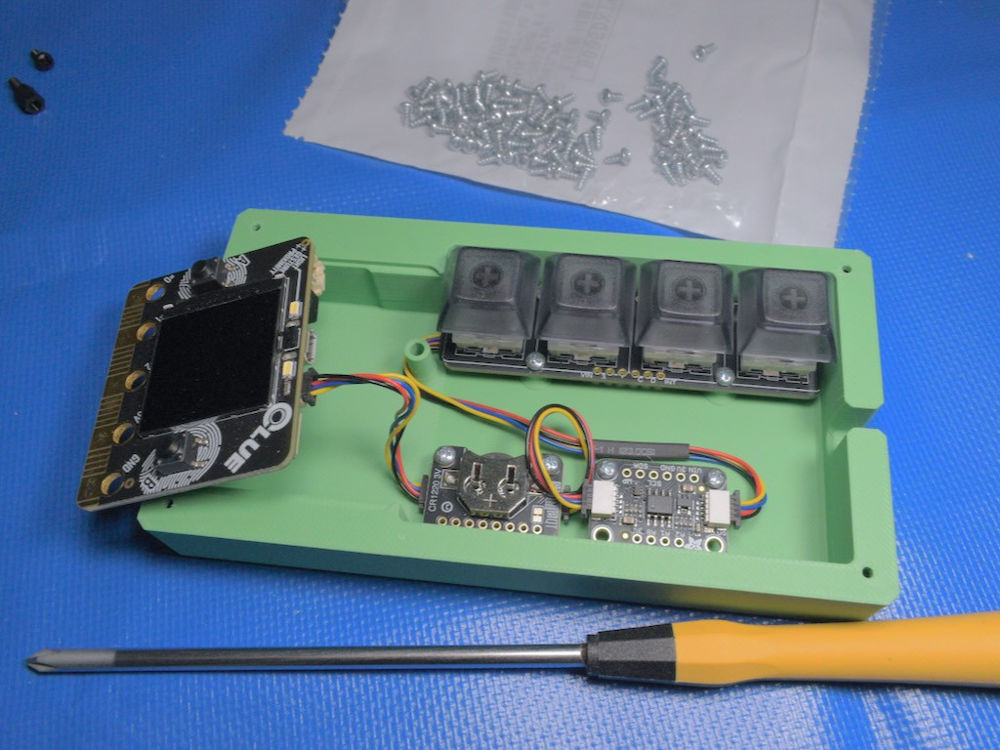

<!-- SPDX-License-Identifier: MIT -->
<!-- SPDX-FileCopyrightText: Copyright 2025 Sam Blenny -->
# NeoKey TOTP Token


This is a two factor authentication token to generate TOTP login codes for up
to four accounts. You can select which account by pressing a key on the 4-key
NeoKey keypad. The design is intended for desktop use in a safe location (wall
power + no worries of physical tampering) but where you do want to prevent
secrets from leaking over the network due to mis-configured cloud-sync backup
features or whatever.

Design Goals and Features:

1. Make the codes really easy to read and type, even in low light, by using a
   dimmable backlit TFT display with a relatively large font.

2. Support 4 TOTP account slots (one for each key of a 4-key NeoKey keypad).

3. The NeoPixel under the key for the currently selected account slot lights
   up. Pressing a different key switches the selected account. Pressing the
   selected key a second time puts the token in standby mode (backlight and
   NeoPixels off).

4. Store secrets in an I2C EEPROM rather than in the CLUE board's flash. This
   makes it so the secrets aren't trivially accessible to a connected computer
   as USB mass storage files. This way, they won't get accidentally sucked into
   backups, and malware would have to work harder to access them.

5. Set DS3231 RTC time from the USB serial console by opening the REPL,
   importing the `util` module, then calling `util.set_time()`.

6. Add and manage TOTP accounts in the EEPROM's database of account slots by
   using similar REPL functions (`import util` then `util.menu()`).

7. Use the token fully airgapped after initial setup by powering it from a
   phone charger and reading codes off the TFT display.


## Hardware



The code here is written for:
- [Adafruit CLUE - nRF52840 Express](https://www.adafruit.com/product/4500)
- [Adafruit DS3231 Precision RTC](https://www.adafruit.com/product/5188)
- [Adafruit 24LC32 I2C EEPROM](https://www.adafruit.com/product/5146)
- [Adafruit NeoKey 1x4 QT I2C Mechanical Key Switches with NeoPixels](https://www.adafruit.com/product/4980)

Additional Parts:
- [Kailh Mechanical Key Switches Cherry MX Brown Compatible](https://www.adafruit.com/product/4954)
- [Translucent Smoke DSA Keycaps for MX Compatible Switches](https://www.adafruit.com/product/5008)
- [CR1220 3V Lithium Coin Cell Battery](https://www.adafruit.com/product/380)
- [STEMMA QT / Qwiic JST SH 4-Pin Cable - 50mm Long](https://www.adafruit.com/product/4399) (qty 2)
- [STEMMA QT / Qwiic JST SH 4-Pin Cable - 100mm Long](https://www.adafruit.com/product/4210) (qty 1)
- 2-28x3/16" Thread Rolling Screws (very short self tapping plastic screws)
- 2-28x1/4" Thread Rolling Screws (short self tapping plastic screws)


## 3D Printable Enclosure

The Blender design file and STL printable files for the enclosure are in the
[enclosure/](enclosure) directory.

To attach the I2C breakout boards to the base of the enclosure, use 2-28x3/16"
thread rolling screws. To attach the bezel to the base, use 2-28x1/4" thread
rolling screws.


## Install & Setup

You will need to:

1. Ensure your CLUE board has an [up to date bootloader](https://learn.adafruit.com/adafruit-clue/update-bootloader)

2. Download CircuitPython 10.0.3 .UF2 file from the circuitpython.org downloads
   page for
   [CLUE NRF52840 Express](https://circuitpython.org/board/clue_nrf52840_express/)

3. Follow Adafruit's
   [CircuitPython on CLUE](https://learn.adafruit.com/adafruit-clue/circuitpython)
   Learn guide to install CircuitPython: plug CLUE into a computer, double-click
   CLUE's reset button, wait for CLUEBOOT drive, drag UF2 file onto CLUEBOOT
   drive, wait for copy to finish.

4. Unplug the CLUE and assemble the rest of the hardware.

5. Get the project bundle from the release page and copy its code and library
   files from the 10.x directory to your board's `CIRCUITPY` drive.


## Set RTC Time in UTC

When you first install a battery in the DS3231, the time will be wildly wrong.
You can set the time from the REPL by importing the `util` module then calling
`util.set_time()`, like this:

```
Adafruit CircuitPython 10.0.3 on 2025-10-17; Adafruit CLUE nRF52840 Express with nRF52840
>>> import util
>>> util.now()
'2000-01-01 02:06:52'
>>> util.set_time()
Set DS3231 RTC time...
   year: 2025
  month: 11
    day: 25
   hour: 00
 minute: 01
seconds: 02
new RTC time:  2025-11-25 00:01:02
>>> # wait a while, then check the time
>>> util.get_time()
2025-11-25 00:06:02
>>>
```

When you set the time, use a GPS or NTP synchronized reference that shows UTC
time with seconds (e.g. https://samblenny.github.io/totp-util/clock/ ). Don't
set the clock according to your local timezone. You must use UTC.

Each of the "year:", "month:", "day:", etc. prompts come from python's
`input()` function. The text on the left is the input prompt shown by
`set_time()`, and the numbers on the right are an example of what you might
type for your response. When you hit return or enter for the seconds line, the
time will be set immediately.


## Store TOTP Accounts in EEPROM Database

The `util` module has several functions for managing the 4KB EEPROM as a
database of TOTP account details. You can enter QR code URIs with a 2D barcode
reader or by decoding elsewhere then copying and pasting. The EEPROM database
only stores a short (8 character) label and the 32 byte decoded seed (from the
`&secret=...` TOTP URI query parameter). The only supported options for
`&algorithm=`, `&digits=`, and `&period=` are SHA1, 6 digits, and 30 seconds.
That will work for many services that use TOTP. If you need something else, you
can modify the code.

To get started managing the EEPROM database, open the USB serial console and do
the Ctrl-C thing to get into the CircuitPython REPL. From there, import util
then call `util.menu()` to see what's available. The first time, you will need
to format the EEPROM. After that, you can add, erase, or copy accounts as you
like. There are 4 available slots (one for each key of a 4-key NeoKey keypad).

This is an example of how it looks to use the menu and provision two demo
accounts (I used a USB 2D barcode reader to type the otpauth URIs):

```
>>> import util
>>> util.menu()
Available functions:

 1. add_totp_account()    - Add a new TOTP account.
 2. copy_totp_account()   - Copy a TOTP account to another slot.
 3. erase_totp_account()  - Erase a TOTP account from EEPROM.
 4. format_eeprom()       - Format the EEPROM for TOTP storage.
 5. get_time()            - Get the current DS3231 RTC time.
 6. list_totp_accounts()  - List all stored TOTP accounts.
 7. set_time()            - Set the DS3231 RTC time.

Choose a function by number (or Enter to cancel): 4
Are you sure? This will erase all data. (y/n): y
Writing header page...
Zeroing 127 pages:
................................................................
...............................................................
EEPROM formatted successfully.
>>> util.add_totp_account()
Enter slot number (1-4): 1
Enter label (max 8 chars): Alice
Enter TOTP URI: otpauth://totp/Example:alice@google.com?secret=JBSWY3DPEHPK3PXP&issuer=Example
Record added to slot 1.
>>> util.add_totp_account()
Enter slot number (1-4): 2
Enter label (max 8 chars): JohnDoe
Enter TOTP URI: otpauth://totp/ACME%20Co:john.doe@email.com?secret=HXDMVJECJJWSRB3HWIZR4IFUGFTMXBOZ&issuer=ACME%20Co&algorithm=SHA1&digits=6&period=30
Record added to slot 2.
>>> util.list_totp_accounts()
Slot 1: 'Alice'
Slot 2: 'JohnDoe'
Slot 3: -- empty --
Slot 4: -- empty --
>>>
```
